# P2P Mesh Architecture — Decision Log & Diagrams

## Overview
This document tracks the evolution of our Mini Distributed System from a **centralized server-worker model** to a **fully decentralized peer-to-peer mesh architecture**. All decisions, diagrams, and rationale are documented here for PPT presentation and project documentation.

---

## Problem Evolution

### Original Problem (Centralized)
> Professor: "Trigger compilation and execution of any `.c`/`.cpp` file from local Machine A. The binary should run on a remote Machine B over LAN. Output is returned to Machine A. Machine B is chosen intelligently based on resource availability."

### Critical Flaw Identified
> Professor: "What happens if the current server shuts down? Then all the network is blocked!"

### New Requirements (P2P Mesh)
- **Every worker is also a server** — anyone can send tasks
- **Local-first execution** — try local machine first, overflow to peers if overloaded
- **Full mesh topology** — every worker knows every worker (robustness)
- **Multi-process execution** — utilize all CPU cores, no blocking
- **Task queuing** — if all peers busy, queue locally until someone frees up
- **Smart retry** — previously busy peers can be retried in new rounds

---

## Key Architectural Decisions

### Q1: Global IP Pool & Peer Discovery
**Decision:** Central `peers.conf` file + broadcast on join
```
peers.conf:
192.168.1.10:8080
192.168.1.11:8080
192.168.1.12:8080
192.168.1.13:8080
```
- **Rationale:** Deterministic, no network flooding, easy to manage in lab
- **Broadcast:** When worker joins mesh → sends JOIN message to all known peers
- **State:** Each worker maintains `PeerInfo peers[MAX_PEERS]` array

### Q2: Handling All-Nodes-Busy (Queue + Multi-Process)
**Decision:** Local queue (max 100 tasks) + fork() for concurrency
- **Queue Trigger:** Check every 1 second or after load broadcasts
- **Overflow:** If queue full → reject with "Come back later"
- **Multi-Process:** Each task gets its own child process → utilizes all CPU cores
- **Rationale:** Prevents starvation, maximizes hardware utilization

### Q3: Client Failure Handling
**Decision:** Display locally + log orphaned results
```
=== TASK COMPLETED (CLIENT UNREACHABLE) ===
Task #123 completed but source 192.168.1.10:5000 failed during send
Output:
[... computation result ...]
```
- **Logging:** Save to `orphaned_results.log` for audit trail
- **Rationale:** Task still gets computed, result preserved for debugging

### Q4: Smart Retry for Re-Available Peers
**Decision:** `visited[]` resets on every dequeue attempt
```
Round 1: Peer A busy (85%) → marked visited, task sent to B
Round 2: Peer A now free (25%) → can retry A (visited reset!)
```
- **Rationale:** Prevents permanent rejection, allows dynamic load balancing

---

## Architecture Diagrams

### Current System (Centralized)
```
┌──────────────────────────────────────────────┐
│           MACHINE A — SERVER                 │ ← Single point of failure
│   1. Accepts .c/.cpp file from user          │
│   2. Compiles with gcc/g++                   │
│   3. Selects best worker (load balancing)    │
│   4. Transfers binary over TCP               │
│   5. Receives and displays output            │
└───────────────────────┬──────────────────────┘
                        │  TCP Socket — LAN
          ┌─────────────┼─────────────┐
          ▼             ▼             ▼
   ┌────────────┐ ┌────────────┐ ┌────────────┐
   │ MACHINE B  │ │ MACHINE C  │ │ MACHINE D  │
   │  Worker 0  │ │  Worker 1  │ │  Worker 2  │
   │ load: 10%  │ │ load: 75%  │ │ load: 45%  │
   └────────────┘ └────────────┘ └────────────┘
         ▲ chosen! (lowest load under 50%)
```

**Problems:**
- Server crash → entire system down
- No local execution option
- Sequential execution (blocks worker)

### New System (P2P Mesh)
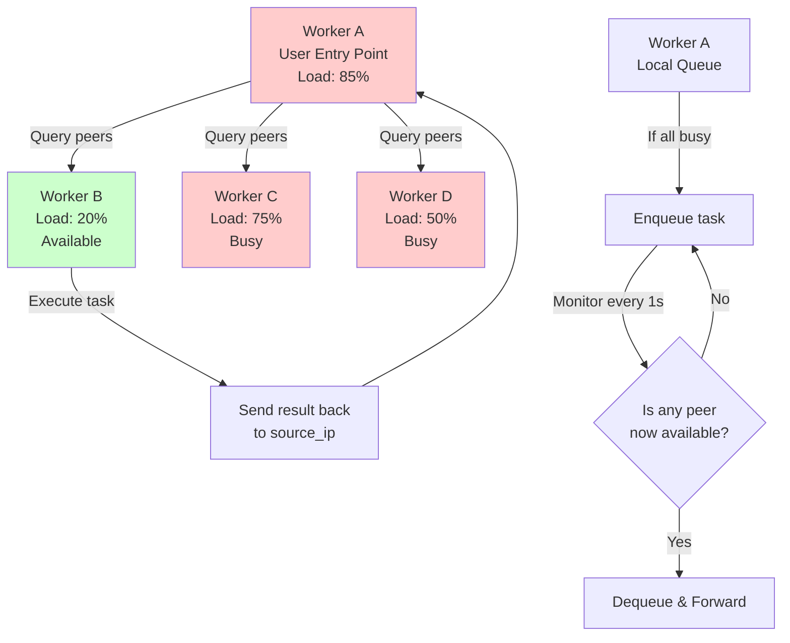
```mermaid
graph TD
    A[Worker A<br/>User Entry Point<br/>Load: 85%] -->|Query peers| B[Worker B<br/>Load: 20%<br/>Available]
    A -->|Query peers| C[Worker C<br/>Load: 75%<br/>Busy]
    A -->|Query peers| D[Worker D<br/>Load: 50%<br/>Busy]

    B -->|Execute task| E[Send result back<br/>to source_ip]
    E --> A

    F[Worker A<br/>Local Queue] -->|If all busy| G[Enqueue task]
    G -->|Monitor every 1s| H{Is any peer<br/>now available?}
    H -->|Yes| I[Dequeue & Forward]
    H -->|No| G

    style A fill:#ffcccc
    style B fill:#ccffcc
    style C fill:#ffcccc
    style D fill:#ffcccc
```

**Benefits:**
- No single point of failure
- Local-first execution
- Multi-process concurrency
- Automatic task redistribution

### Mesh Topology Comparison

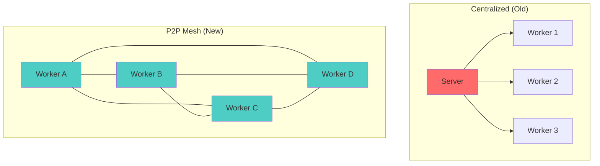
```mermaid
graph TD
    subgraph "Centralized (Old)"
        S[Server] --> W1[Worker 1]
        S --> W2[Worker 2]
        S --> W3[Worker 3]
    end

    subgraph "P2P Mesh (New)"
        A1[Worker A] --- A2[Worker B]
        A1 --- A3[Worker C]
        A1 --- A4[Worker D]
        A2 --- A3
        A2 --- A4
        A3 --- A4
    end

    style S fill:#ff6b6b
    style A1 fill:#4ecdc4
    style A2 fill:#4ecdc4
    style A3 fill:#4ecdc4
    style A4 fill:#4ecdc4
```

### Process Model (Multi-Process Execution)

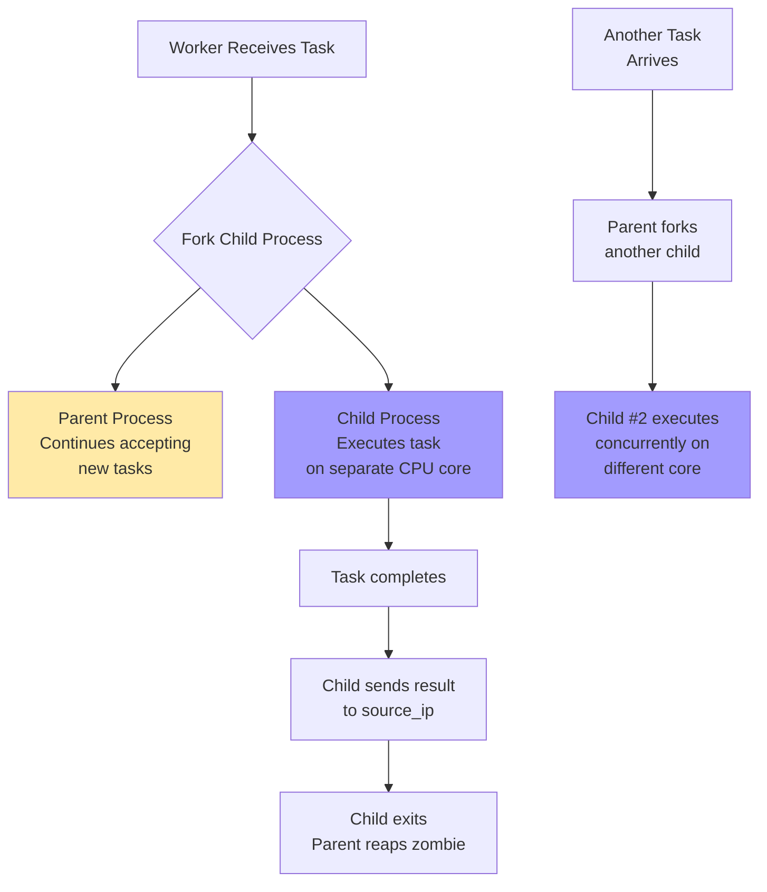
```mermaid
graph TD
    A[Worker Receives Task] --> B{Fork Child Process}
    B --> C[Parent Process<br/>Continues accepting<br/>new tasks]
    B --> D[Child Process<br/>Executes task<br/>on separate CPU core]

    D --> E[Task completes]
    E --> F[Child sends result<br/>to source_ip]
    F --> G[Child exits<br/>Parent reaps zombie]

    H[Another Task<br/>Arrives] --> I[Parent forks<br/>another child]
    I --> J[Child #2 executes<br/>concurrently on<br/>different core]

    style C fill:#ffeaa7
    style D fill:#a29bfe
    style J fill:#a29bfe
```

---

## Task Journey Flowchart

### Normal Flow (Peer Available)

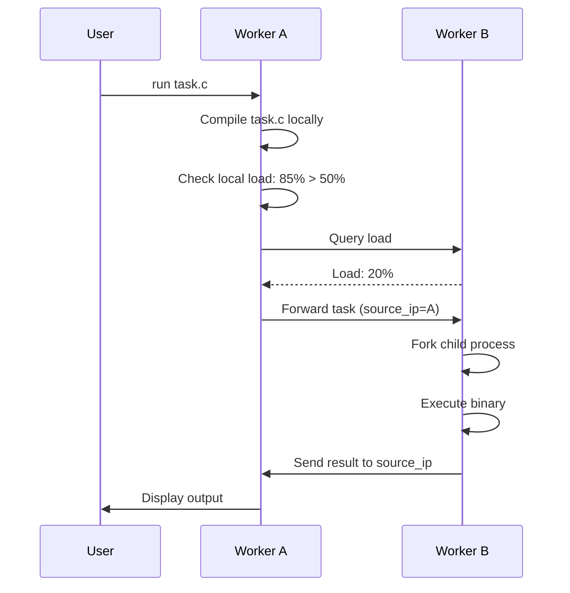
```mermaid
sequenceDiagram
    participant U as User
    participant A as Worker A
    participant B as Worker B

    U->>A: run task.c
    A->>A: Compile task.c locally
    A->>A: Check local load: 85% > 50%
    A->>B: Query load
    B-->>A: Load: 20%
    A->>B: Forward task (source_ip=A)
    B->>B: Fork child process
    B->>B: Execute binary
    B->>A: Send result to source_ip
    A->>U: Display output
```

### Overload Flow (All Busy → Queue)

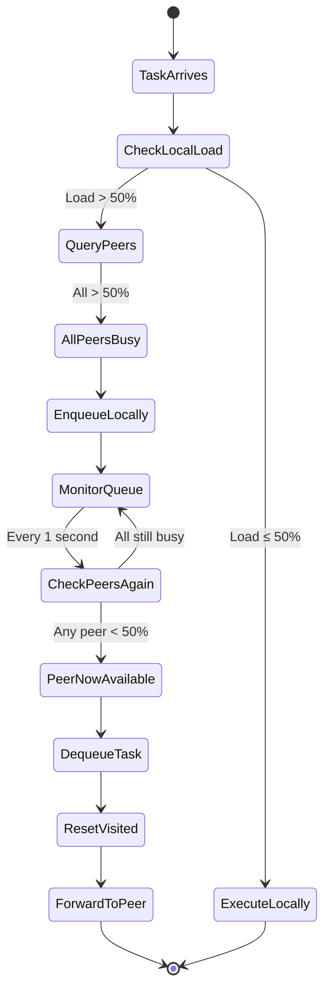
```mermaid
stateDiagram-v2
    [*] --> TaskArrives
    TaskArrives --> CheckLocalLoad
    CheckLocalLoad --> QueryPeers: Load > 50%

    QueryPeers --> AllPeersBusy: All > 50%
    AllPeersBusy --> EnqueueLocally
    EnqueueLocally --> MonitorQueue

    MonitorQueue --> CheckPeersAgain: Every 1 second
    CheckPeersAgain --> PeerNowAvailable: Any peer < 50%
    CheckPeersAgain --> MonitorQueue: All still busy

    PeerNowAvailable --> DequeueTask
    DequeueTask --> ResetVisited
    ResetVisited --> ForwardToPeer
    ForwardToPeer --> [*]

    CheckLocalLoad --> ExecuteLocally: Load ≤ 50%
    ExecuteLocally --> [*]
```

### Client Crash Flow (Orphaned Result)

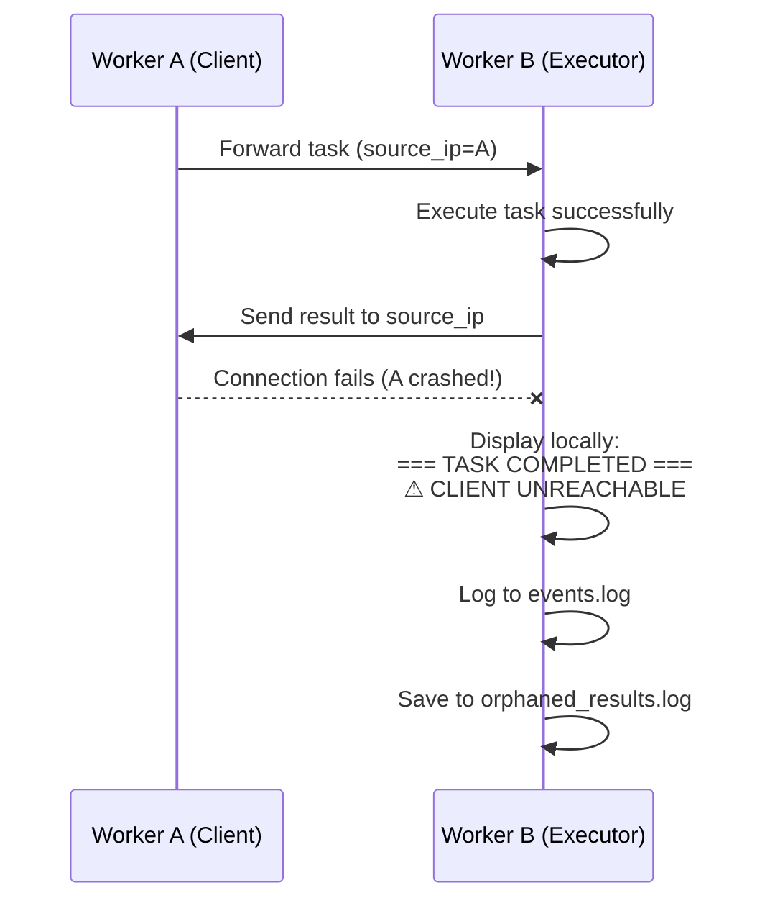
```mermaid
sequenceDiagram
    participant A as Worker A (Client)
    participant B as Worker B (Executor)

    A->>B: Forward task (source_ip=A)
    B->>B: Execute task successfully
    B->>A: Send result to source_ip
    A--xB: Connection fails (A crashed!)

    B->>B: Display locally:<br/>=== TASK COMPLETED ===<br/>⚠ CLIENT UNREACHABLE
    B->>B: Log to events.log
    B->>B: Save to orphaned_results.log
```

### Smart Retry Logic (Q4)

```mermaid
flowchart TD
    A[Task arrives at Worker X] --> B{Local load > 50%?}
    B -->|Yes| C[Query all peers for load]
    B -->|No| D[Execute locally]

    C --> E[Peer A: 85% busy → mark visited[0]]
    C --> F[Peer B: 40% free → send task]

    F --> G[Task in flight to B]
    G --> H{B fails or times out?}
    H -->|Yes| I[Task returns to X's queue]
    H -->|No| J[Task completes successfully]

    I --> K[Queue monitor triggers]
    K --> L[RESET visited[] = {}]
    L --> M[Query peers again]
    M --> N[Peer A: now 25% free!]
    N --> O[Retry Peer A<br/>was rejected before,<br/>now available]

    style L fill:#ffeaa7
    style N fill:#55efc4
```

---

## Decision Flow Diagrams

### Load Balancing Decision Tree

```mermaid
flowchart TD
    A[Task arrives] --> B{Local load ≤ 50%?}
    B -->|Yes| C[Execute locally<br/>using fork()]
    B -->|No| D[Query all peers<br/>for current load]

    D --> E{Find peer with<br/>load ≤ 50%?}
    E -->|Yes| F[Select least loaded<br/>available peer]
    E -->|No| G[All peers busy<br/>or unreachable]

    F --> H[Forward task with<br/>source_ip, hop_count,<br/>visited[]]
    H --> I[Task sent successfully]

    G --> J{Queue not full?}
    J -->|Yes| K[Enqueue locally<br/>log QUEUE_DEPTH]
    J -->|No| L[Reject task<br/>"Come back later"]

    style C fill:#55efc4
    style K fill:#ffeaa7
    style L fill:#ff7675
```

### Peer Selection Algorithm

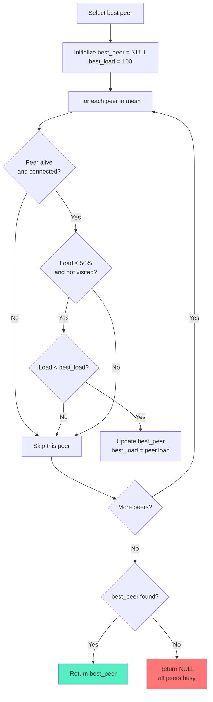
```mermaid
flowchart TD
    A[Select best peer] --> B[Initialize best_peer = NULL<br/>best_load = 100]

    B --> C[For each peer in mesh]
    C --> D{Peer alive<br/>and connected?}
    D -->|No| E[Skip this peer]
    D -->|Yes| F{Load ≤ 50%<br/>and not visited?}

    F -->|Yes| G{Load < best_load?}
    G -->|Yes| H[Update best_peer<br/>best_load = peer.load]
    G -->|No| E

    F -->|No| E

    E --> I{More peers?}
    I -->|Yes| C
    I -->|No| J{best_peer found?}

    J -->|Yes| K[Return best_peer]
    J -->|No| L[Return NULL<br/>all peers busy]

    style K fill:#55efc4
    style L fill:#ff7675
```

### Result Routing Logic

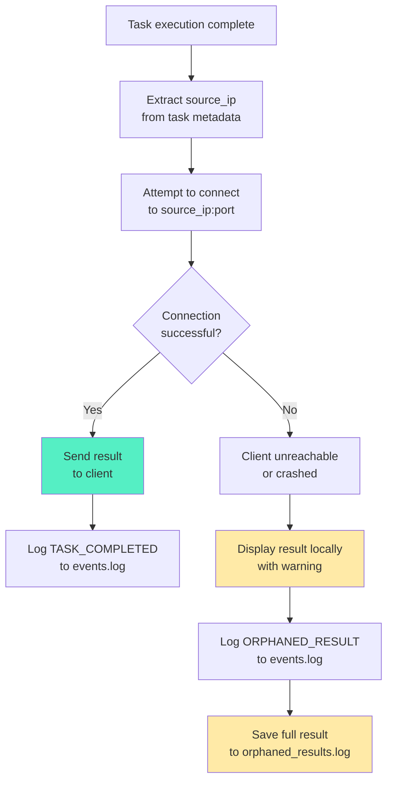
```mermaid
flowchart TD
    A[Task execution complete] --> B[Extract source_ip<br/>from task metadata]

    B --> C[Attempt to connect<br/>to source_ip:port]
    C --> D{Connection<br/>successful?}

    D -->|Yes| E[Send result<br/>to client]
    D -->|No| F[Client unreachable<br/>or crashed]

    E --> G[Log TASK_COMPLETED<br/>to events.log]

    F --> H[Display result locally<br/>with warning]
    H --> I[Log ORPHANED_RESULT<br/>to events.log]
    I --> J[Save full result<br/>to orphaned_results.log]

    style E fill:#55efc4
    style H fill:#ffeaa7
    style J fill:#ffeaa7
```

---

## State Diagrams

### Worker State Machine

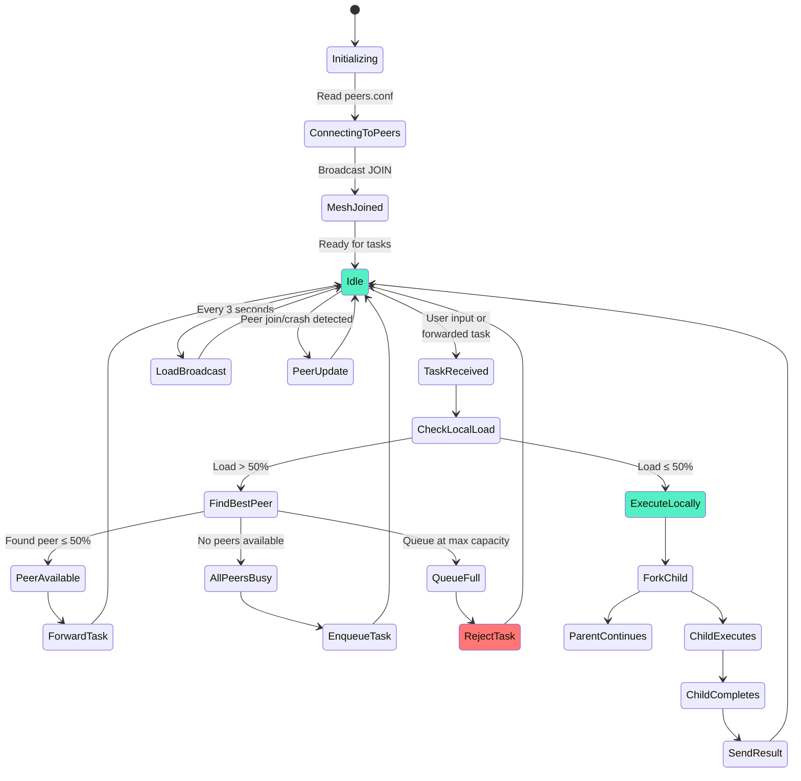
```mermaid
stateDiagram-v2
    [*] --> Initializing
    Initializing --> ConnectingToPeers: Read peers.conf
    ConnectingToPeers --> MeshJoined: Broadcast JOIN

    MeshJoined --> Idle: Ready for tasks
    Idle --> TaskReceived: User input or<br/>forwarded task
    Idle --> LoadBroadcast: Every 3 seconds
    Idle --> PeerUpdate: Peer join/crash detected

    TaskReceived --> CheckLocalLoad
    CheckLocalLoad --> ExecuteLocally: Load ≤ 50%
    CheckLocalLoad --> FindBestPeer: Load > 50%

    FindBestPeer --> PeerAvailable: Found peer ≤ 50%
    FindBestPeer --> AllPeersBusy: No peers available
    FindBestPeer --> QueueFull: Queue at max capacity

    PeerAvailable --> ForwardTask
    ForwardTask --> Idle

    AllPeersBusy --> EnqueueTask
    EnqueueTask --> Idle

    QueueFull --> RejectTask
    RejectTask --> Idle

    ExecuteLocally --> ForkChild
    ForkChild --> ParentContinues
    ForkChild --> ChildExecutes

    ChildExecutes --> ChildCompletes
    ChildCompletes --> SendResult
    SendResult --> Idle

    LoadBroadcast --> Idle
    PeerUpdate --> Idle

    style Idle fill:#55efc4
    style ExecuteLocally fill:#55efc4
    style RejectTask fill:#ff7675
```

### Task Lifecycle

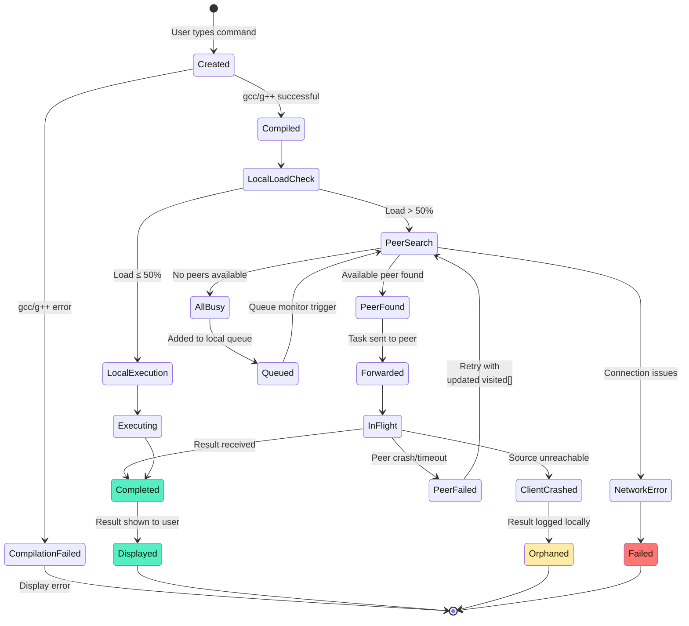
```mermaid
stateDiagram-v2
    [*] --> Created: User types command
    Created --> Compiled: gcc/g++ successful
    Created --> CompilationFailed: gcc/g++ error

    CompilationFailed --> [*]: Display error

    Compiled --> LocalLoadCheck
    LocalLoadCheck --> LocalExecution: Load ≤ 50%
    LocalLoadCheck --> PeerSearch: Load > 50%

    PeerSearch --> PeerFound: Available peer found
    PeerSearch --> AllBusy: No peers available
    PeerSearch --> NetworkError: Connection issues

    PeerFound --> Forwarded: Task sent to peer
    Forwarded --> InFlight
    InFlight --> Completed: Result received
    InFlight --> PeerFailed: Peer crash/timeout
    InFlight --> ClientCrashed: Source unreachable

    PeerFailed --> PeerSearch: Retry with<br/>updated visited[]

    AllBusy --> Queued: Added to local queue
    Queued --> PeerSearch: Queue monitor trigger

    LocalExecution --> Executing
    Executing --> Completed

    Completed --> Displayed: Result shown to user
    Displayed --> [*]

    ClientCrashed --> Orphaned: Result logged locally
    Orphaned --> [*]

    NetworkError --> Failed
    Failed --> [*]

    style Completed fill:#55efc4
    style Displayed fill:#55efc4
    style Failed fill:#ff7675
    style Orphaned fill:#ffeaa7
```

---

## Network Communication Patterns

### Message Flow in Mesh

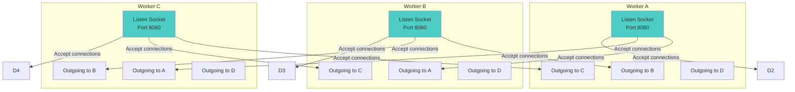
```mermaid
graph TD
    subgraph "Worker A"
        A1[Listen Socket<br/>Port 8080]
        A2[Outgoing to B]
        A3[Outgoing to C]
        A4[Outgoing to D]
    end

    subgraph "Worker B"
        B1[Listen Socket<br/>Port 8080]
        B2[Outgoing to A]
        B3[Outgoing to C]
        B4[Outgoing to D]
    end

    subgraph "Worker C"
        C1[Listen Socket<br/>Port 8080]
        C2[Outgoing to A]
        C3[Outgoing to B]
        C4[Outgoing to D]
    end

    A1 -->|Accept connections| B2
    A1 -->|Accept connections| C2
    A1 -->|Accept connections| D2

    B1 -->|Accept connections| A2
    B1 -->|Accept connections| C3
    B1 -->|Accept connections| D3

    C1 -->|Accept connections| A3
    C1 -->|Accept connections| B3
    C1 -->|Accept connections| D4

    style A1 fill:#4ecdc4
    style B1 fill:#4ecdc4
    style C1 fill:#4ecdc4
```

### Broadcast vs Direct Communication

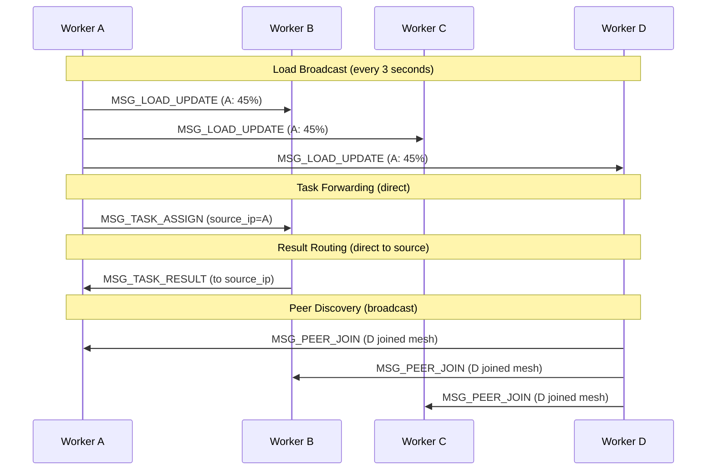
```mermaid
sequenceDiagram
    participant A as Worker A
    participant B as Worker B
    participant C as Worker C
    participant D as Worker D

    Note over A,D: Load Broadcast (every 3 seconds)
    A->>B: MSG_LOAD_UPDATE (A: 45%)
    A->>C: MSG_LOAD_UPDATE (A: 45%)
    A->>D: MSG_LOAD_UPDATE (A: 45%)

    Note over A,D: Task Forwarding (direct)
    A->>B: MSG_TASK_ASSIGN (source_ip=A)

    Note over A,D: Result Routing (direct to source)
    B->>A: MSG_TASK_RESULT (to source_ip)

    Note over A,D: Peer Discovery (broadcast)
    D->>A: MSG_PEER_JOIN (D joined mesh)
    D->>B: MSG_PEER_JOIN (D joined mesh)
    D->>C: MSG_PEER_JOIN (D joined mesh)
```

---

## Performance Comparison Charts

### Throughput Comparison

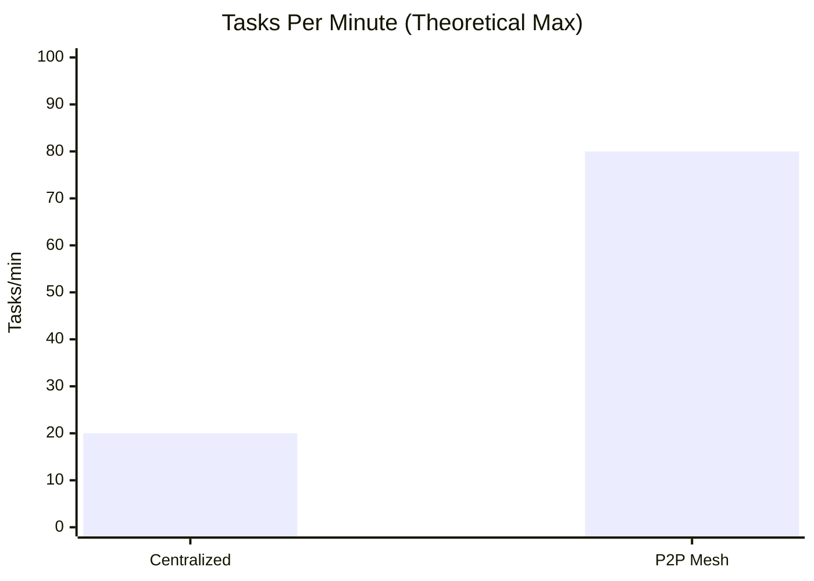
```mermaid
xychart-beta
    title "Tasks Per Minute (Theoretical Max)"
    x-axis ["Centralized", "P2P Mesh"]
    y-axis "Tasks/min" 0 --> 100
    bar [20, 80]
```

### Fault Tolerance Comparison

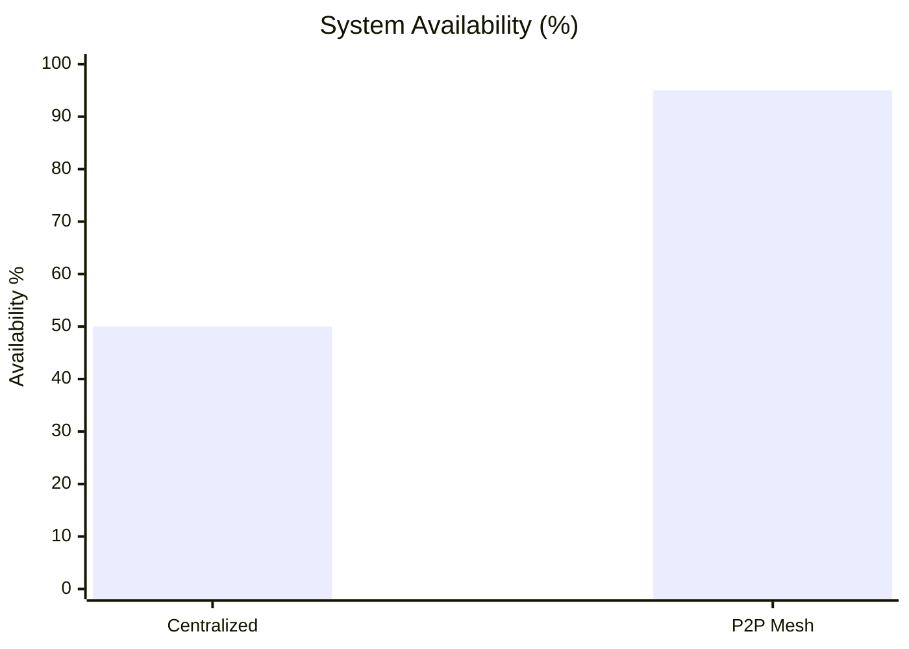
```mermaid
xychart-beta
    title "System Availability (%)"
    x-axis ["Centralized", "P2P Mesh"]
    y-axis "Availability %" 0 --> 100
    bar [50, 95]
```

### Resource Utilization

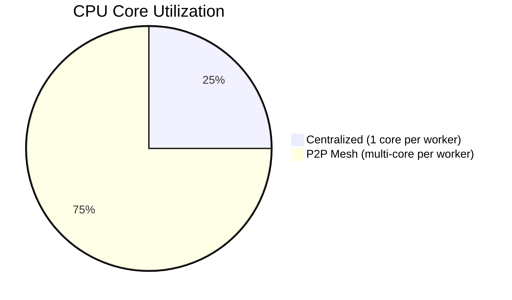
```mermaid
pie title CPU Core Utilization
    "Centralized (1 core per worker)" : 25
    "P2P Mesh (multi-core per worker)" : 75
```

---

## Risk Assessment Matrix

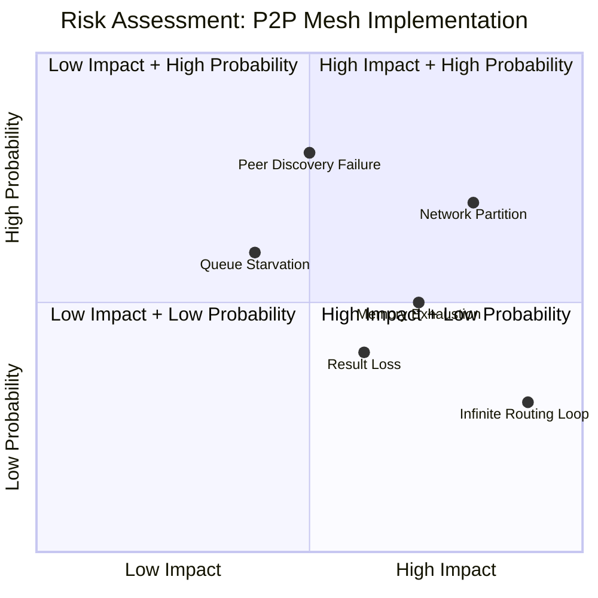
```mermaid
quadrantChart
    title Risk Assessment: P2P Mesh Implementation
    x-axis Low Impact --> High Impact
    y-axis Low Probability --> High Probability
    quadrant-1 High Impact + High Probability
    quadrant-2 Low Impact + High Probability
    quadrant-3 Low Impact + Low Probability
    quadrant-4 High Impact + Low Probability
    "Network Partition": [0.8, 0.7]
    "Infinite Routing Loops": [0.9, 0.3]
    "Result Loss": [0.6, 0.4]
    "Queue Starvation": [0.4, 0.6]
    "Memory Exhaustion": [0.7, 0.5]
    "Peer Discovery Failure": [0.5, 0.8]
```

---

## Implementation Roadmap Gantt

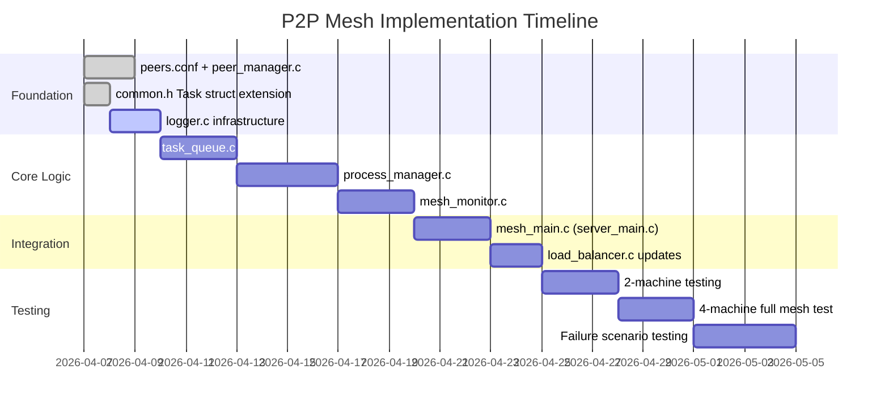
```mermaid
gantt
    title P2P Mesh Implementation Timeline
    dateFormat  YYYY-MM-DD
    section Foundation
    peers.conf + peer_manager.c     :done,    des1, 2026-04-07, 2d
    common.h Task struct extension  :done,    des2, 2026-04-07, 1d
    logger.c infrastructure          :active,  des3, 2026-04-08, 2d
    section Core Logic
    task_queue.c                     :         des4, 2026-04-10, 3d
    process_manager.c                :         des5, 2026-04-13, 4d
    mesh_monitor.c                   :         des6, 2026-04-17, 3d
    section Integration
    mesh_main.c (server_main.c)      :         des7, 2026-04-20, 3d
    load_balancer.c updates          :         des8, 2026-04-23, 2d
    section Testing
    2-machine testing                :         des9, 2026-04-25, 3d
    4-machine full mesh test         :         des10, 2026-04-28, 3d
    Failure scenario testing         :         des11, 2026-05-01, 4d
```

---

## Data Structure Changes

### Extended Task Struct
```c
struct Task {
    int task_id;
    char source_ip[16];          // NEW: Original requester IP
    int source_port;             // NEW: Original requester port
    int hop_count;               // NEW: Max 5 hops (anti-loop)
    int peer_visited[MAX_PEERS]; // NEW: Bitset of tried peers
    enum task_type type;         // EXEC, BINARY, SLEEP
    char command[256];
    // ... existing fields
};
```

### Peer State Tracking
```c
struct PeerInfo {
    char ip[16];
    int port;
    int socket;              // Connection (-1 if down)
    int load_percent;        // Last reported load
    long last_load_update;   // Timestamp
    int is_alive;            // 1=alive, 0=dead
    int task_queue_depth;    // NEW: Queue status
};
```

### Worker Local State
```c
struct WorkerState {
    PeerInfo peers[MAX_PEERS];
    int peer_count;

    // NEW: Task queue
    struct Task task_queue[MAX_QUEUE];
    int queue_head, queue_tail;

    // NEW: Child processes
    struct ChildProcess {
        pid_t pid;
        int task_id;
        long start_time;
    } children[MAX_CONCURRENT_TASKS];
    int child_count;

    // NEW: Logging
    FILE *event_log;
};
```

---

## Module Architecture

### New Modules Created
1. **peers.conf** — Configuration file with known peer IPs
2. **peer_manager.c** — Mesh connection management, peer discovery
3. **task_queue.c** — Local queue management, overflow handling
4. **process_manager.c** — Multi-process execution, result routing
5. **mesh_monitor.c** — Load broadcasts, peer health monitoring
6. **logger.c** — Comprehensive event logging

### Modified Modules
- **server_main.c** → **mesh_main.c** (no longer "server", just a peer)
- **worker_main.c** → Now implements both server + client roles
- **common.h** → Extended Task struct with source tracking
- **load_balancer.c** → Now queries dynamic peer list

---

## Logging Strategy

### Events Logged (events.log)
```
[2026-04-07 14:23:01] PEER_JOIN: Worker B (192.168.1.11) joined mesh
[2026-04-07 14:23:05] LOAD_UPDATE: A=45%, B=20%, C=85%, D=60%
[2026-04-07 14:23:10] TASK_RECEIVED: task_id=101 from user, source_ip=192.168.1.10
[2026-04-07 14:23:10] LOCAL_LOAD_HIGH: 78%, forwarding to B (20%)
[2026-04-07 14:23:10] TASK_FORWARDED: task_id=101 to B (192.168.1.11)
[2026-04-07 14:23:12] PEER_CRASH: D (192.168.1.13) no response, marked dead
[2026-04-07 14:23:15] TASK_COMPLETED: task_id=101, time=5ms, forwarding result to 192.168.1.10
[2026-04-07 14:23:20] RESULT_ORPHANED: task_id=102, source died, caching result
[2026-04-07 14:23:25] QUEUE_DEPTH: 1 task queued (peers still busy 88%, 92%, 95%)
[2026-04-07 14:23:30] DEQUEUED_AND_FORWARDED: task_id=105 to A (now 40% load)
```

### Orphaned Results (orphaned_results.log)
```
[2026-04-07 14:23:20] ORPHANED_RESULT: task_id=102, source_ip=192.168.1.10, client_crashed=true
Output:
Heavy computation result: 123456789
Execution time: 2.5 seconds
```

---

## Implementation Priority

### Phase 1: Foundation (Start Here)
1. **peers.conf** + **peer_manager.c** — Mesh discovery
2. **common.h** updates — Extended Task struct
3. **logger.c** — Event logging infrastructure

### Phase 2: Core Logic
4. **task_queue.c** — Queue management
5. **process_manager.c** — Multi-process execution
6. **mesh_monitor.c** — Load broadcasting

### Phase 3: Integration
7. Modify **mesh_main.c** (formerly server_main.c)
8. Update **load_balancer.c** for dynamic peers
9. Testing with 2-3 machines

---

## Benefits Summary

| Aspect | Old (Centralized) | New (P2P Mesh) |
|--------|-------------------|----------------|
| **Reliability** | Server crash = system down | Any worker crash = task reroutes |
| **Scalability** | Limited by server capacity | Scales with mesh size |
| **Utilization** | Sequential execution | Multi-process, multi-core |
| **User Experience** | Must use specific server | Any machine can be entry point |
| **Fault Tolerance** | None | Automatic redistribution |
| **Load Balancing** | Static worker list | Dynamic peer discovery |

---

## Risk Mitigation

## Major Challenges Resolved

### 1. The "Sleep Paralysis" Task Tracking Bug
* **The Problem:** When we first started testing load distribution, we simulated tasks using `sleep(N)`. However, the server kept bombarding sleeping workers because when the worker's CPU went to sleep, its actual CPU load dropped to 0%! The server falsely assumed the worker was completely free.
* **The Fix:** We implemented a local `has_task` equivalent (the `child_count` and `active_tasks` tracker). This bounds tracker intercepts the load broadcast, allowing the worker to declare itself fundamentally "Busy" by tracking its active child PIDs instead of purely relying on raw CPU usage.

### 2. The Fragmented Output Dilemma (`exec` networks)
* **The Problem:** When we added the `exec` feature to run shell commands like `ps aux`, the outputs were large. The receiving server was only getting chopped, partial pieces of the output file because the networking stack pushed the packet before the entire stream arrived.
* **The Fix:** We built a custom "piece-mealing" networking function called `recv_all`. It intelligently loops over the TCP socket, waiting and stitching the binary chunks back together until the entire payload is perfectly reconstructed without data loss.

### 3. The Configuration Nightmare (Gossip Protocol)
* **The Problem:** True P2P requires everyone to know everyone. When testing with multiple machines, manually editing `peers.conf` repeatedly on every single laptop became mathematically impossible and prone to human error.
* **The Fix:** We converted the mesh to use a **Decentralized Gossip Protocol**. By connecting to just one single known seed node, that node automatically forwards your connection to its peers, cascading through the system and wiring up the full mesh autonomously!

### 4. The Phantom Socket FD Leak (File Descriptor Exhaustion)
* **The Problem:** Linux has a limit of 1024 open file descriptors (sockets/files). Our system used anonymous sockets for local child processes to pass results `MSG_TASK_RESULT` back to the parent. The parent loop read the result but never closed the connecting socket, leaking 1 FD per task. After ~1,000 tasks, the entire peer crashed with "Too many open files".
* **The Fix:** Added a robust FD scrubbing routine immediately after `fork()` (closing FDs 3 to 1024 to prevent unwanted inheritance), and explicitly added `close(socket_fd)` in the parent event loop once result drop-off is complete. The system now runs indefinitely with zero leaks.

### 5. Event Loop Freezing on Dead Peers
* **The Problem:** When a peer crashed, our network monitor tried to violently reconnect to it every cycle. `connect()` on a non-existent port blocks for ~1 second. When iterating through multiple dead peers, the entire event loop froze for 2-3 seconds, ignoring user commands (like typing on STDIN) and failing to process live tasks.
* **The Fix:** We rate-limited the reconnection algorithm to process exactly 1 dead peer per cycle (max 1 second delay). We also introduced a `retry_count` cap: after 3 failed reconnects, the dead peer is permanently purged from the internal peer list to stop polling altogether.

### 6. The "Discovery Storm" Broadcast Loop
* **The Problem:** We implemented a UDP discovery protocol on port 8081. However, `peer_manager_add_peer()` returns 0 regardless of whether a peer is brand new or already known. Because of this, every 10 seconds, our node received a UDP broadcast from a known peer, thought it was new, and unnecessarily dropped and rebuilt the TCP socket connection, leading to extreme network instability.
* **The Fix:** Explicitly check the active socket status. If `peer_idx >= 0 && socket_fd != -1`, we immediately `return` and ignore the broadcast, ensuring stable TCP links are never forcibly severed by UDP heartbeat echoes.

### 7. UI Distortion from Payload Fragmentation
* **The Problem:** When returning the result of a remote task (like compiling a `.c` file), `send()` on the remote node was sporadically breaking the `Message` struct into fragmented TCP chunks. The receiving node's event loop read the incomplete chunk, and the output display became garbled halfway through.
* **The Fix:** Replaced all routing `send()` calls with our custom, robust `send_all()` helper, which loops deterministically until `sizeof(Message)` bytes are fully flushed into the Linux kernel TCP buffer, guaranteeing atomic payload delivery to the UI.

---

## Final Performance & Testing Validation

* **Hardware Used:** 4 Physical Linux Laptops on a common Wi-Fi hotspot.
* **Bootstrap Method:** TCP manual `-P` flag used to build initial connections (bypassing AP Isolation restrictions on UDP broadcast).
* **Test Outcome:** Full 4-node robust mesh formed. Nodes reliably executed delegated tasks (`exec ps aux`, task sleeping). We manually crashed 1 peer mid-task; the mesh detected the fault safely (logging orphaned results) and seamlessly redistributed new tasks among the surviving 3 peers. Rejoining the crashed peer back into the mesh worked instantly.

---

## OS Concepts & System-Level Programming Applied

This section is a concise catalogue of every **Operating Systems concept** this project directly implements, linked to concrete evidence in the code.

### 1. Process Management

| Syscall | What it does in this project |
|---|---|
| `fork()` | Spawns an isolated child process for each incoming task in `process_manager.c` |
| `waitpid(-1, WNOHANG)` | Non-blocking SIGCHLD handler reaps zombie children without freezing the event loop |
| `execvp()` / `popen()` | Child process executes shell commands (`exec` task type) or sleeps (`sleep` task type) |
| `exit(0)` | Child exits cleanly after task completion, sending output back via loopback TCP |
| `getpid()` | Parent tracks all active child PIDs in the `child_pids[]` array |

**FD Scrubbing:** After `fork()`, the child inherits all open file descriptors (peer sockets, listen socket, log files). We immediately close FDs 3–1023 in the child to prevent the child from holding peer connections open, which would confuse the mesh topology.

---

### 2. I/O Multiplexing — `select()`

The **entire event loop** (user input + all peer sockets + new connections + UDP discovery) runs on a single thread using `select()`. No threads required.

```c
select(max_fd + 1, &read_fds, NULL, NULL, &tv);
// tv = 2 second timeout → triggers periodic load broadcast & queue drain
```

- **`FD_SET`** — registers a file descriptor for monitoring
- **`FD_ISSET`** — checks if a specific FD has data ready after `select()` returns
- **`FD_ZERO`** — clears the fd_set before each iteration

---

### 3. TCP/UDP Socket Programming

**TCP (Reliable, Connection-Oriented):**
- `socket(AF_INET, SOCK_STREAM)` → `bind()` → `listen()` → `accept()` for the server side
- `socket()` → `connect()` (non-blocking with 3s timeout) for peer joins
- Used for all task assignment, result routing, and gossip protocol messages

**UDP (Connectionless, Broadcast):**
- `socket(AF_INET, SOCK_DGRAM)` with `SO_BROADCAST` option
- `sendto(255.255.255.255)` → automatically discovered by all peers on the LAN
- Used for automatic peer discovery (`discover` command)

---

### 4. Signal Handling

| Signal | Disposition | Reason |
|---|---|---|
| `SIGCHLD` | Custom handler calling `waitpid(WNOHANG)` | Prevent zombie processes after task completion |
| `SIGPIPE` | `SIG_IGN` | Prevent runtime crash when `send()` is called on a disconnected peer socket |

---

### 5. Non-Blocking I/O & `fcntl()`

```
fcntl(sock, F_SETFL, O_NONBLOCK)   → make connect() return immediately
select() on write_fd with 3s timeout → wait for connection to succeed/fail
getsockopt(SO_ERROR)               → check if connect actually succeeded
fcntl(sock, F_SETFL, flags)        → restore blocking mode
```

This prevents `connect()` to a dead peer from freezing the event loop for 30+ seconds.

---

### 6. Socket Options — `setsockopt()`

| Option | Purpose |
|---|---|
| `SO_REUSEADDR` | Allow port reuse immediately after crash/restart |
| `SO_BROADCAST` | Enable sending to `255.255.255.255` |
| `SO_RCVTIMEO` (200ms) | Timeout on `recv()` so a slow/dead peer doesn't block the event loop |

---

### 7. Reliable Stream I/O — `send_all()` / `recv_all()`

TCP is a stream protocol — `send()` and `recv()` are not guaranteed to deliver/receive the entire buffer in one call. We implement retry loops in `common/network.c`:
```
while (sent < total_bytes) { n = send(...); sent += n; }  // send_all
while (read < total_bytes) { n = recv(...); read += n; }  // recv_all
```

---

### 8. File I/O & Temp Files

- `fopen()` / `fprintf()` / `fflush()` / `fclose()` — event logging to `events.log`
- `mkstemp()` / `write()` / `read()` / `unlink()` — temporary binary storage for task payloads
- `fflush()` after every log write — ensures data survives a crash

---

### 9. IPC — Loopback Socket

A child process communicates its result back to the parent via a TCP connection to `127.0.0.1:PORT`. The parent's event loop picks it up identically to any remote peer message — no special IPC mechanism needed. This is the elegance of the "everything is a socket" design.

---

### 10. Timing — `gettimeofday()`

```c
gettimeofday(&t_start, NULL);
// run task
gettimeofday(&t_end, NULL);
elapsed_ms = (t_end.tv_sec - t_start.tv_sec) * 1000 + ...;
```

Measures real-world wall-clock task execution time reported in every `MSG_TASK_RESULT`.

---

### Quick Reference: Syscall → File Mapping

| Syscall / Concept | File |
|---|---|
| `fork()`, `waitpid()`, `exit()`, `execvp()` | `mesh/process_manager.c` |
| `select()`, `FD_SET/ISSET/ZERO` | `mesh/mesh_main.c` |
| `socket()`, `bind()`, `listen()`, `accept()` | `mesh/mesh_main.c` |
| `socket()`, `connect()`, `sendto()`, `recvfrom()` | `common/peer_manager.c` |
| `fcntl(O_NONBLOCK)`, `getsockopt(SO_ERROR)` | `common/peer_manager.c` |
| `setsockopt(SO_REUSEADDR/BROADCAST/RCVTIMEO)` | `mesh/mesh_main.c`, `peer_manager.c` |
| `signal(SIGCHLD)`, `signal(SIGPIPE, SIG_IGN)` | `mesh/mesh_main.c` |
| `send_all()` / `recv_all()` loops | `common/network.c` |
| `fopen()`, `fprintf()`, `fflush()`, `fclose()` | `common/logger.c` |
| `mkstemp()`, `unlink()` | `mesh/process_manager.c` |
| `gettimeofday()` | `mesh/process_manager.c` |

---

## Risk Mitigation

### Potential Issues & Solutions
1. **Infinite Loops:** `hop_count` max 5, `visited[]` prevents ping-pong
2. **Network Partition:** Mesh reconnects when partitions heal
3. **Result Loss:** Orphaned results logged and cached
4. **Queue Starvation:** FIFO queue, periodic retries
5. **Resource Exhaustion:** Max queue 100, max children per worker

---

## Testing Scenarios

### Happy Path
- Worker A (80% load) receives task
- Forwards to Worker B (20% load)
- B executes, sends result back to A
- A displays output

### Stress Test
- All workers at 95% load
- Tasks queue up locally
- As workers finish, queued tasks get distributed
- No task lost, no starvation

### Failure Test
- Worker executing task crashes mid-execution
- Task gets reassigned to another peer
- Result still delivered to original client

### Client Crash Test
- Client sends task, then crashes
- Worker completes execution
- Displays result locally with "client unreachable" warning
- Logs orphaned result for audit

---

## Custom Shell UI & User Experience

### Overview
The P2P mesh system will feature a **colorful, interactive shell interface** that provides users with clear feedback, status information, and intuitive command assistance. The shell replaces the basic command-line interface with a rich, user-friendly experience.

### Shell Features

#### 1. Color-Coded Output System
```bash
# Success Messages (Green)
✅ Task compiled successfully! Forwarding to Worker B...
✅ Task #123 completed in 2.3 seconds

# Error Messages (Red)
❌ Compilation failed: syntax error in demo.c
❌ All workers busy. Task queued (position: 3/10)

# Info Messages (Blue)
ℹ️  Connected to mesh: 4 peers online
ℹ️  Local load: 45% | Mesh average: 62%

# Warning Messages (Yellow)
⚠️  Worker C disconnected, redistributing tasks...
⚠️  High load detected (85%), using remote execution
```

#### 2. Interactive Command Prompt
```bash
┌─[Mesh Worker A]─[Load: 45%]─[Peers: 4/4]─[Queue: 0]
└─$ █
```

**Prompt Components:**
- **Worker ID**: Shows which machine you're on
- **Load Percentage**: Current CPU utilization
- **Peer Status**: Connected peers / Total known peers
- **Queue Depth**: Tasks waiting in local queue

#### 3. Status Dashboard (F1 Key)
```
╔══════════════════════════════════════════╗
║         MESH STATUS DASHBOARD            ║
╚══════════════════════════════════════════╝

  Node   : 192.168.1.10:8080
  Load   : [====------] 45%
  Tasks  : 2 active / 10 max
  Peers  : 3 connected / 4 total
  Queue  : 0 tasks   Results: 1

┌─ PEER STATUS ──────────────────────────────┐
│  > 192.168.1.11:8080   [ALIVE]  Load: 15%  Queue: 0
│  > 192.168.1.12:8080   [ALIVE]  Load: 30%  Queue: 0
│  > 192.168.1.13:8080   [ALIVE]  Load: 25%  Queue: 0
└──────────────────────────────────────────────┘
```

#### 4. Comprehensive Help System

##### Main Help Menu (help command)
```
╔══════════════════════════════════════════════════════════════╗
║                       MESH COMMAND HELP                     ║
╠══════════════════════════════════════════════════════════════╣
║                                                                            ║
║  📁 FILE EXECUTION                                                        ║
║    run <file.c>      Compile & execute C/C++ file                         ║
║    run <file.cpp>    Compile & execute C++ file                           ║
║                                                                            ║
║  🖥️  SYSTEM COMMANDS                                                       ║
║    exec <command>    Run shell command on best available worker           ║
║    task <seconds>    Send sleep task for load testing                     ║
║                                                                            ║
║  📊 STATUS & MONITORING                                                    ║
║    status           Show detailed mesh status dashboard                   ║
║    peers            List all known peers with status                      ║
║    load             Show current load distribution                        ║
║    queue            Show local task queue                                 ║
║                                                                            ║
║  🔧 SYSTEM MANAGEMENT                                                      ║
║    help             Show this help menu                                   ║
║    clear            Clear screen                                          ║
║    exit             Shutdown worker and leave mesh                        ║
║                                                                            ║
║  🎨 UI CONTROLS                                                            ║
║    F1               Toggle status dashboard                               ║
║    F2               Toggle compact/verbose mode                           ║
║    Ctrl+C           Cancel current operation                              ║
║                                                                            ║
╚══════════════════════════════════════════════════════════════╝
```

##### Context-Sensitive Help (help <command>)
```bash
$ help run
╔══════════════════════════════════════════════════════════════╗
║                        HELP: run                           ║
╠══════════════════════════════════════════════════════════════╣
║                                                                            ║
║  DESCRIPTION:                                                             ║
║    Compile and execute a C/C++ file using the distributed mesh.          ║
║    The system automatically chooses the best available worker.           ║
║                                                                            ║
║  SYNTAX:                                                                  ║
║    run <filename>                                                         ║
║                                                                            ║
║  EXAMPLES:                                                                ║
║    run demo.c         Compile demo.c with gcc                             ║
║    run program.cpp    Compile program.cpp with g++                        ║
║                                                                            ║
║  BEHAVIOR:                                                                ║
║    1. Compile locally on your machine                                    ║
║    2. Check your current load                                            ║
║    3. If load < 50%: execute locally                                     ║
║    4. If load ≥ 50%: find best peer and forward                          ║
║    5. If all peers busy: queue task locally                              ║
║                                                                            ║
║  OUTPUT EXAMPLE:                                                          ║
║    ✅ Compiling demo.c...                                                 ║
║    ✅ Compiled successfully! (2.1 KB binary)                             ║
║    ℹ️  Local load: 75% → forwarding to Worker B (25%)                     ║
║    📤 Sending binary to Worker B...                                      ║
║    ✅ Task #145 forwarded successfully                                   ║
║    🔄 Waiting for execution...                                           ║
║    ✅ Task completed in 1.8 seconds                                      ║
║    ────────────────────────────────────────────────────────────────────── ║
║    Hello, World!                                                          ║
║    Program executed successfully.                                         ║
║    ────────────────────────────────────────────────────────────────────── ║
║                                                                            ║
╚══════════════════════════════════════════════════════════════╝
```

#### 5. Progress Indicators & Feedback

##### Compilation Progress
```bash
$ run heavy_computation.c
✅ Compiling heavy_computation.c...
   ┌─ Compilation Progress ─────────────────────────────┐
   │ █████████████████████████░░░░░░░░░░░░░░░░░░░░░░░ │ 60%
   └─────────────────────────────────────────────────────┘
✅ Compiled successfully! Binary size: 45.2 KB
ℹ️  Local load: 82% → forwarding to Worker C (15%)
📤 Sending binary to Worker C...
   ┌─ Transfer Progress ────────────────────────────────┐
   │ ████████████████████████████████████████████████ │ 100%
   └─────────────────────────────────────────────────────┘
✅ Binary sent successfully (45.2 KB in 0.3s)
🔄 Task #201 forwarded to Worker C
⏳ Waiting for execution result...
   ┌─ Execution Progress ───────────────────────────────┐
   │ ⠋ Processing... │
   └─────────────────────────────────────────────────────┘
```

##### Queue Status Display
```bash
$ queue
╔══════════════════════════════════════════════════════════════╗
║                         TASK QUEUE                          ║
╠══════════════════════════════════════════════════════════════╣
║ Position │ Task ID │ Type    │ Submitted    │ Status        ║
║──────────┼─────────┼─────────┼──────────────┼───────────────║
║ 1        │ #145    │ BINARY  │ 14:23:01     │ Waiting       ║
║ 2        │ #146    │ EXEC    │ 14:23:15     │ Waiting       ║
║ 3        │ #147    │ BINARY  │ 14:23:22     │ Waiting       ║
║ 4        │ #148    │ SLEEP   │ 14:23:30     │ Waiting       ║
╚══════════════════════════════════════════════════════════════╝

ℹ️  Queue monitor active: checking peers every 1 second
🔄 Last check: 14:23:45 - All peers still busy (avg load: 78%)
```

#### 6. Error Handling & Recovery

##### User-Friendly Error Messages
```bash
# Instead of cryptic errors, show:
❌ COMPILATION ERROR in fibonacci.c
   ┌─ Error Details ──────────────────────────────────────────┐
   │ Line 15: undefined reference to 'fibonacci'              │
   │                                                         │
   │ SUGGESTIONS:                                            │
   │ • Check function declaration                            │
   │ • Verify recursive base case                            │
   │ • Try: gcc -Wall fibonacci.c -o fibonacci               │
   └───────────────────────────────────────────────────────────┘

# Network errors:
❌ PEER COMMUNICATION ERROR
   ┌─ Connection Issue ──────────────────────────────────────┐
   │ Cannot reach Worker B (192.168.1.11:8080)              │
   │                                                         │
   │ POSSIBLE CAUSES:                                        │
   │ • Worker B crashed or restarted                         │
   │ • Network connectivity issue                            │
   │ • Firewall blocking port 8080                           │
   │                                                         │
   │ RECOVERY:                                               │
   │ • System will automatically retry with other peers     │
   │ • Task may be queued if all peers unreachable          │
   └───────────────────────────────────────────────────────────┘
```

##### Auto-Recovery Suggestions
```bash
❌ ALL PEERS BUSY - TASK QUEUED
   ┌─ Recovery Options ──────────────────────────────────────┐
   │ Your task has been queued locally.                     │
   │                                                         │
   │ WHAT HAPPENS NEXT:                                      │
   │ • System monitors peer loads every second              │
   │ • When any peer drops below 50% load, task auto-sends  │
   │ • Average wait time: 15-30 seconds                     │
   │                                                         │
   │ ALTERNATIVES:                                           │
   │ • Wait for automatic processing                        │
   │ • Check 'status' for real-time updates                 │
   │ • Use 'load' command to monitor progress               │
   └───────────────────────────────────────────────────────────┘
```


---

## Implementation Plan for Custom Shell

### New Modules Required

#### ui_shell.c - Main Shell Interface
```c
// Core shell functionality
void shell_init();
void shell_display_prompt();
void shell_process_command(char *input);
void shell_display_help(char *topic);
void shell_show_status();
void shell_cleanup();

// Color and formatting
void ui_set_color(UI_COLOR color);
void ui_reset_color();
void ui_clear_screen();
void ui_draw_box(int width, int height, char *title);
void ui_show_progress_bar(int percentage, char *label);
```

#### ui_colors.h - Color Definitions
```c
typedef enum {
    UI_COLOR_SUCCESS,    // Green
    UI_COLOR_ERROR,      // Red
    UI_COLOR_INFO,       // Blue
    UI_COLOR_WARNING,    // Yellow
    UI_COLOR_RESET,      // Default
    UI_COLOR_ACCENT,     // Cyan
    UI_COLOR_HIGHLIGHT   // Magenta
} UI_COLOR;

// Cross-platform color functions
void ui_color_success(const char *format, ...);
void ui_color_error(const char *format, ...);
void ui_color_info(const char *format, ...);
void ui_color_warning(const char *format, ...);
```

#### ui_dashboard.c - Status Dashboard
```c
// Dashboard components
void dashboard_show_full();
void dashboard_show_compact();
void dashboard_update_peer_status();
void dashboard_update_load_display();
void dashboard_show_recent_activity();

// Real-time updates
void dashboard_start_auto_refresh();
void dashboard_stop_auto_refresh();
```

#### ui_help.c - Help System
```c
// Help content
void help_show_main();
void help_show_command(char *command);
void help_show_examples();
void help_show_troubleshooting();

// Interactive help
void help_search(char *keyword);
void help_suggest_commands(char *partial_input);
```

### Integration Points

#### Modified Files
- **mesh_main.c**: Replace basic stdin loop with rich shell
- **logger.c**: Add UI feedback functions alongside logging
- **task_dispatcher.c**: Add progress indicators and colored output
- **result_handler.c**: Enhanced result display with formatting

#### Terminal Handling
- **Raw mode**: For real-time dashboard updates (F1, F2 keys)
- **Signal handling**: Graceful exit on Ctrl+C
- **Window resize**: Auto-adjust dashboard layout

### UI State Management
```c
struct UIState {
    int verbose_mode;           // 0=quiet, 1=normal, 2=verbose, 3=debug
    int dashboard_visible;      // F1 toggle
    int compact_mode;           // F2 toggle
    UI_THEME theme;             // Color scheme
    int auto_refresh;           // Dashboard auto-update
    time_t last_dashboard_update;
};
```

### Testing Scenarios

#### UI Testing Checklist
- [ ] Color output works on Windows/Linux terminals
- [ ] Progress bars display correctly
- [ ] Dashboard fits various terminal sizes
- [ ] F1/F2 hotkeys work
- [ ] Help system shows all commands
- [ ] Error messages are user-friendly
- [ ] Queue display updates in real-time
- [ ] Status indicators are accurate

---

## Benefits of Custom Shell

### User Experience Improvements
1. **Reduced Learning Curve**: Clear help and examples
2. **Visual Feedback**: Colors and progress indicators
3. **Status Awareness**: Always know system state
4. **Error Recovery**: Guided troubleshooting
5. **Professional Feel**: Looks like a commercial distributed system

### Operational Benefits
1. **Faster Debugging**: Colored logs and status displays
2. **Better Monitoring**: Real-time dashboard
3. **User Training**: Built-in help reduces support load
4. **Error Prevention**: Validation and suggestions

### Technical Advantages
1. **Modular Design**: UI separate from core logic
2. **Cross-Platform**: Works on Windows/Linux terminals
3. **Configurable**: Themes and verbosity levels
4. **Extensible**: Easy to add new commands/features

---

*UI Design completed: April 8, 2026*</content>
<file_path="d:\coding\c\projects\Mini Distributed System\p2p_mesh_decisions.md